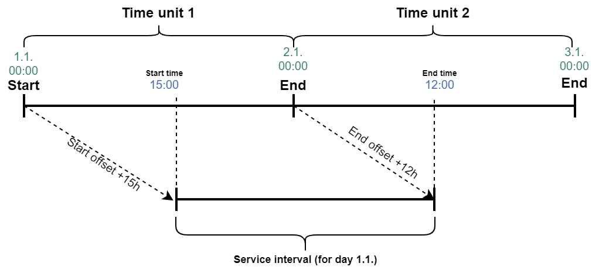

# Operations

## Get configuration

Preferred initial call used to obtain all static data about distributor configuration for the client.

### Request`[ApiBaseUrl]/api/distributor/v1/configuration/get`

```json
{
    "Client": "My Client 1.0.0",
    "Ids": [
        "3edbe1b4-6739-40b7-81b3-d369d9469c48",
        ...
    ],
    "PrimaryId": "3edbe1b4-6739-40b7-81b3-d369d9469c48"
}
```

| Property | Type | Contract | Description |
| :--- | :--- | :--- | :--- |
| `Client` | string | required | Identification of the client as described in [authorization](./authorization.md). |
| `PrimaryId` | string | required | Unique identifier of a primary [configuration](./operations.md#configuration). |
| `Ids` | array of string | required | Unique identifiers of [configuration](./operations.md#configuration)s. |

### Response

```json
{
    "Cities": [
        {
            "Id": "9044b0bf-cbe0-4df5-beeb-b32e19bcd073",
            "ImageId": "e956201e-ba2f-470f-8070-b43f9cd72194",
            "Name": {
                "en-US": "Amsterdam"
            }
        }
    ],
    "CityId": "9044b0bf-cbe0-4df5-beeb-b32e19bcd073",
    "Configurations": [
        {
            "Id": "3edbe1b4-6739-40b7-81b3-d369d9469c48",
            "AdultCount": null,
            "ChildCount": null,
            "ChildSelectionEnabled": null,
            "CompetitorRateDescription": {
                "en-US": "Competitor Rate Description"
            },
            "CompetitorPriceRelativeAdjustment": 1.1,
            "DisplayAvailability": null,
            "DisplayPromoCode": null,
            "DisplayRateComparision": null,
            "DisplaySpecialRequests": null,
            "Enterprise": {
                "AcceptedCurrencyCodes": ["EUR"],
                "AdditionalLegalStatements": {
                    "en-US": "Lorem ipsum."
                },
                "Address": {
                    "City": "Zeist",
                    "CountryCode": "NL",
                    "Latitude": 52.0749748,
                    "Line1": "Arnhemse Bovenweg 31",
                    "Line2": "",
                    "Longitude": 5.2590181,
                    "PostalCode": "3708 AA"
                },
                "Categories": [
                    {
                        "Description": {
                            "en-US": "Our Single Castleroom is a cozy and comfortable room with a single bed (80x200), spacious bathroom with guest supplies, working desk and a flat screen TV. This quiet non-smoking room of 15m2 has a nice view of the Castle and of course there is free high speed Wi-Fi.\r\n"
                        },
                        "ExtraBedCount": 0,
                        "Id": "295d96e7-8501-4cbd-b78d-8bf590bf6db9",
                        "Name": { "en-US": "Single Castleroom" },
                        "NormalBedCount": 1,
                        "Ordering": 0,
                        "SpaceType": "Room"
                    }
                ],
                "CategoryImageAssignments": [
                    {
                      "Id": "69832f4b-4b47-4d32-9b89-ac0600de0cd6",
                      "CategoryId": "295d96e7-8501-4cbd-b78d-8bf590bf6db9",
                      "ImageId": "f987a97c-5049-44ca-9933-5b657e5263e2",
                      "Ordering": 2
                    }
                ],
                "CityId": "39db0c2f-6929-47ec-9386-0abdaaef4c9c",
                "DefaultCurrencyCode": "EUR",
                "DefaultLanguageCode": "nl-NL",
                "DefaultRateCurrencyCode": "EUR",
                "Description": { "nl-NL": "" },
                "Email": "info@kasteelkerckebosch.com",
                "IanaTimeZoneIdentifier": "Europe/Berlin",
                "Id": "7a13590c-6538-461e-b02f-6357400de493",
                "ImageId": "263c3e5f-e11d-41d8-9746-4bdd0852f04f",
                "IntroImageId": "f24469f8-c23b-4450-a1f8-3ecd39904e99",
                "Name": {
                    "en-US": "Sample Hotel Description"
                },
                "Pricing": "Gross",
                "PrivacyPolicyUrl": {
                    "en-US": "https://localhost/en"
                },
                "Products": [
                    {
                        "Id": "4fd0e6e0-101c-410d-8c12-ad6000b7e390",
                        "Name": {
                            "en-US": "Breakfast"
                        },
                        "Description": {},
                        "CategoryId": "77e0a18c-f2a5-418f-b578-16d3599c059d",
                        "ImageId": null,
                        "IncludedByDefault": false,
                        "Pricing": {
                            "Discriminator": "Absolute",
                            "Value": {
                                "CHF": {
                                    "Currency": "CHF",
                                    "GrossValue": 108.31,
                                    "NetValue": 98.46,
                                    "TaxValues": [
                                        {
                                            "TaxRateCode": "CZ-L",
                                            "Value": 9.85
                                        }
                                    ]
                                },
                                "EUR": {
                                    "Currency": "EUR",
                                    "GrossValue": 100,
                                    "NetValue": 90.91,
                                    "TaxValues": [
                                        {
                                            "TaxRateCode": "CZ-L",
                                            "Value": 9.09
                                        }
                                    ]
                                }
                            }
                        },
                        "ChargingMode": "PerTimeUnit",
                        "PostingMode": "PerTimeUnit",
                        "Ordering": 1
                    },
                    {
                        "Id": "5d6de830-8ada-4b65-b72c-60fc1e719f1b",
                        "Name": {
                            "nl-NL": "Extra bedlinnen",
                            "en-US": "Extra bedlinnen (Once Off)"
                        },
                        "Description": {},
                        "CategoryId": "77e0a18c-f2a5-418f-b578-16d3599c059d",
                        "ImageId": "ec643f33-cd6c-4250-accd-518182165ffe",
                        "IncludedByDefault": false,
                        "Pricing": {
                            "Discriminator": "Relative",
                            "Value": {
                                "ProductIds": [],
                                "TaxRateCodes": [
                                    "CZ-L"
                                ],
                                "Multiplier": 0.05,
                                "Target": "GrossValue"
                            }
                        },
                        "ChargingMode": "Once",
                        "PostingMode": "Once",
                        "Ordering": 0
                    }
                ],
                "TaxEnvironmentCode": "NL",
                "Telephone": "030 6926666",
                "TermsAndConditionsUrl": {
                    "en-US": "https://website.com/terms-and-conditions.html"
                }
            },
            "OnlineTravelAgencies": [],
            "PaymentCardRequirement": "NotRequired",
            "RequiredFields": [],
            "ServiceId": "c1eec12a-1101-4bg6-ad24-e48f8dlpb9ee"
        }
    ],
    "Services": [
        {
            "Id": "c1eec12a-1101-4bg6-ad24-e48f8dlpb9ee",
            "EnterpriseId": "7a13590c-6538-461e-b02f-6357400de493",
            "Ordering": 1,
            "CreatedUtc": "2021-03-30T11:17:03Z",
            "IsActive": true,
            "Names": {
                "en-US": "Accommodation"
            },
            "ShortNames": {
                "en-US": "Accommodation"
            },
            "Data": {
                "Discriminator": "Bookable",
                "Value": {
                    "StartOffset": "P0M0DT15H0M0S",
                    "EndOffset": "P0M0DT12H0M0S",
                    "TimeUnit": "Day"
                }
            }
        }
    ],
    "CurrencyCode": null,
    "CurrencyCodes": [],
    "DisplayVoucherCode": false,
    "EndDateOffset": null,
    "GtmContainerId": "",
    "IntroVideoUrl": "",
    "LanguageCode": null,
    "NowUtc": "2020-04-09T07:18:48Z",
    "PrimaryColor": "",
    "StartDateOffset": null,
    "Theme": null,
    "VoucherCode": ""
}
```

| Property | Type | Contract | Description |
| :--- | :--- | :--- | :--- |
| `Cities` | array of [City](./operations.md#city) | required | Cities supported by the enterprise. |
| `CityId` | string | required | Unique identifier of the default city. |
| `Configurations` | array of [Configuration](./operations.md#configuration)s | required | Configurations of the booking engine instances. |
| `Services` | array of [Service](./operations.md#service)s | required | Services that the configurations are set up for. |
| `CurrencyCode` | string | optional | ISO 4217 code of the currency which Distributor should use when displaying prices. |
| `DisplayVoucherCode` | boolean | required | Determines whether enterprise's voucher codes should be listed in Distributor \(voucher codes are listed by default\). |
| `StartDateOffset` | number | optional | Number of days after the day that the customer is booking that will be selected as the default start date in the date picker \(for example, if `3` is set and a customer uses the booking engine on the 1st day of the month, the default start date will be the 4th\). If left blank, the default will be 0. |
| `EndDateOffset` | number | optional | Number of days after the day that the customer is booking that will be selected as the default end date in the date picker  \(for example, if `3` is set and a customer uses the booking engine on the 1st day of the month, the default end date will be the 3rd\). If left blank, the default will be `4`. |
| `GtmContainerId` | string | optional | Google Tag Manager identifier. |
| `IntroVideoUrl` | string | optional | Distributor's intro video URL. |
| `LanguageCode` | string | optional | Language code which Distributor should use. |
| `NowUtc` | string | required | Current server date and time in UTC timezone in ISO 8601 format. |
| `PrimaryColor` | string | optional | Distributor's primary color in Hex format. |
| `Theme` | [Theme](./operations.md#theme) | optional | Distributor's theme variant. |
| `VoucherCode` | string | optional | Voucher code which enables special rate offerings. |

#### Theme

* `Light`
* `Dark`

#### City

| Property | Type | Contract | Description |
| :--- | :--- | :--- | :--- |
| `Id` | string | required | Unique identifier of the city. |
| `ImageId` | string | optional | Unique identifier of the city image. |
| `Name` | [Localized text](./operations.md#localized-text) | required | City name. |

#### Configuration

| Property | Type | Contract | Description |
| :--- | :--- | :--- | :--- |
| `Id` | string | required | Unique identifier of the configuration. |
| `AdultCount` | number | optional | Default number of adults. |
| `ChildCount` | number | optional | Default number of children. |
| `ChildSelectionEnabled` | boolean | optional | Determines whether to allow adding children to reservations \(true by default\). |
| `CompetitorPriceRelativeAdjustment` | number | optional | Percentage markup with which competitor's prices \(listed in the rate comparison banner if `DisplayRateComparison` is set to `true`\) will be shown, compared to enterprise's Best Available Rate \(BAR\). For example, if enterprise's BAR costs 50, and entered here is `1`, their rate will be shown as 50. If here is entered `1.1`, their rate will be shown as 55 \(as here is added a 10% markup\). |
| `CompetitorRateDescription` | [Localized text](./operations.md#localized-text) | required | Description differentiating enterprise's online booking from competitors booking. \(for example, `20% online booking discount` or `Breakfast included`\). |
| `DisplayAvailability` | boolean | optional | Determines whether to display property's availability next to maximum occupancy in space categories \(availability will be shown by default\). |
| `DisplayRateComparison` | boolean | optional | Determines whether to display rate comparison. |
| `DisplaySpecialRequests` | boolean | optional | Determines whether to display special requests field during checkout. |
| `Enterprise` | [Enterprise](./operations.md#enterprise) | required | Enterprise to which the `Configuration` belongs. |
| `OnlineTravelAgencies` | array of string | required | Array of travel agencies to include in comparison banner. |
| `PaymentCardRequirement` | string [Payment card requirement](./operations.md#payment-card-requirement) | required |  Determines how to handle payment cards. |
| `RequiredFields` | array of [Required field](./operations.md#required-field)s | required | Form fields which are required and need to be filled in. |
| `ServiceId` | string | required | Unique identifier of the service to which the configuration is bound to. |

#### Service

| Property | Type | Contract | Description |
| --- | --- | --- | --- |
| `Id` | string | required | Unique identifier of the service. |
| `EnterpriseId` | string | required | Identifier of the enterprise the service belongs to. |
| `Ordering` | number | required | Number defining the ordering of the services. |
| `CreatedUtc` | string | required | Date and time of the service creation in UTC timezone in ISO 8601 format. |
| `IsActive` | boolean | required | Whether the service is still active. |
| `Names` | [Localized text](./operations.md#localized-text) | required | Service name. |
| `ShortNames` | [Localized text](./operations.md#localized-text) | required | Service short name. |
| `Data` | [Service data](#service-data) | required | Additional information about the specific service. |

#### Service data

| Property | Type | Contract | Description |
| --- | --- | --- | --- |
| `Discriminator` | string [Service data discriminator](#service-data-discriminator) | required | Determines type of value. |
| `Value` | object | required | Structure of object depends on [Service data discriminator](#service-data-discriminator). |

#### Service data discriminator

* `Bookable` - Data specific to a bookable service.

#### Bookable service data

| Property | Type | Contract | Description |
| --- | --- | --- | --- |
| `StartOffset` | string | required | Offset from the start of the time unit defining the default start of the reservations in ISO 8601 duration format. |
| `EndOffset` | string | required | Offset from the end of the time unit defining the default end of the reservations in ISO 8601 duration format. |
| `TimeUnit` | [Time unit](#time-unit) | required | Time unit of the service. |

Time units represent a fixed, finite time interval: a minute, a day, a month, etc. A Time unit defines the operable periods for a bookable service. We currently only support the Day unit.
We think of the daily time unit as the physical time unit that starts at midnight and ends at midnight the following day.

Start offsets are anchored to the start of the time unit and end offsets are anchored to the end of the time unit.
`StartOffset` and `EndOffset` define the default start and end of the service (so, the service orders).

Positive end offsets of the daily time unit define the nightly service as depicted in the diagram below.


Negative or zero end offsets of the daily time unit define the daily service as depicted on the picture below.


#### Time unit

* `Day`
* ...

#### Payment card requirement
* `NotRequired` - Payment card info is never required. 
* `AlwaysRequired` - Payment card info is always required and validated.
* `NotRequiredForFullyPaidBookings` - Payment card info is not required for fully paid bookings. Otherwise required.
* `NotRequiredForFullyOrPartiallyPaidBookings` - Payment card info is not required for fully or partially paid bookings. Otherwise required.

#### Required field

* `Telephone`

#### Enterprise

| Property | Type | Contract | Description |
| :--- | :--- | :--- | :--- |
| `Id` | string | required | Unique identifier of the enterprise. |
| `AcceptedCurrencyCodes` | array of string | required | Array of currency codes in ISO 4217 format accepted by the enterprise. |
| `AdditionalLegalStatements` | array of [Localized text](./operations.md#localized-text) | required | Additional legal statements. |
| `Address` | [Address](./operations.md#address) | required | Address of the enterprise. |
| `Categories` | array of [Room category](./operations.md#room-category) | required | Array of active room categories of the enterprise. |
| `CategoryImageAssignments` | array of [Category image assignment](./operations.md#category-image-assignment) | required | Array of images representing the category image. |
| `CityId` | string | required | Unique identifier of the [City](./operations.md#city). |
| `DefaultCurrencyCode` | string | required | Default enterprise currency code in ISO 4217 format. |
| `DefaultLanguageCode` | string | required | Default enterprise language in ISO format. |
| `DefaultRateCurrencyCode` | string | required | Default enterprise rate currency code in ISO 4217 format. |
| `Description` | [Localized text](./operations.md#localized-text) | required | Enterprise description. |
| `Email` | string | required | Email of the enterprise. |
| `IanaTimeZoneIdentifier` | string | required | IANA time zone identifer. |
| `ImageId` | string | optional | Unique identifier of the enterprise logo. |
| `IntroImageId` | string | optional | Unique identifier of the enterprise intro image. |
| `Name` | [Localized text](./operations.md#localized-text) | required | Enterprise name. |
| `Pricing` | string [Pricing method](./operations.md#pricing-method) | required | Pricing method used by the enterprise. |
| `PrivacyPolicyUrl` | [Localized text](./operations.md#localized-text) | required | Enterprise privacy policy URL. |
| `Products` | array of [Product](./operations.md#product) | required | Array of active products which can be offered to the customer. |
| `TaxEnvironmentCode` | string | required | Tax environment code. |
| `Telephone` | string | required | Telephone of the enterprise. |
| `TermsAndConditionsUrl` | [Localized text](./operations.md#localized-text) | required | Enterprise terms and conditions URL. |

#### Address

| Property | Type |  | Description |
| :--- | :--- | :--- | :--- |
| `City` | string | optional | City. |
| `CountryCode` | string | optional | ISO 3166-1 code of the [country](./operations.md#country). |
| `Latitude` | number | optional | The latitude. |
| `Longitude` | number | optional | The longitude. |
| `Line1` | string | optional | First address line. |
| `Line2` | string | optional | Second address line. |
| `PostalCode` | string | optional | Postal code. |

#### Pricing method

* `Gross` - The enterprise shows amount with gross prices.
* `Net` - The enterprise shows amount with net prices.

## Get hotels

Alternative initial call used to obtain all static data about hotel relevant for the client.

### Request`[ApiBaseUrl]/api/distributor/v1/hotels/get`

```json
{
    "Client": "My Client 1.0.0",
    "HotelId": "3edbe1b4-6739-40b7-81b3-d369d9469c48"
}
```

| Property | Type | Contract | Description |
| :--- | :--- | :--- | :--- |
| `Client` | string | required | Identification of the client as described in [authorization](./authorization.md). |
| `HotelId` | string | required | Unique identifier of hotel. |

### Response

```json
{
    "Languages": [
        {
            "Code": "en-US",
            "Name": "English (United States)",
            "DefaultCulture": {
                "CurrencyDecimalSeparator": ",",
                "CurrencyGroupSeparator": "."
            }
        }
    ],
    "Currencies": [
        {
            "Code": "CZK",
            "Symbol": "Kč",
            "ValueFormat": "#,##0 \"Kč\";−#,##0 \"Kč\"",
            "DecimalPlaces": 0,
            "SymbolIsBehindValue": true
        }
    ],
    "Countries": [
        {
            "Code": "CZ",
            "Name": "Czech Republic"
        }
    ],
    "ImageBaseUrl": "https://cdn.mews-demo.com/Media/Image",
    "Id": "3edbe1b4-6739-40b7-81b3-d369d9469c48",
    "Name": {
        "en-US": "Distributor api hotel"
    },
    "Description": {
        "en-US": ""
    },
    "CityId": "e5fd108e-1e0a-4cc4-9d3a-34d7e0e57527",
    "ImageId": "87ead9b6-8c96-4b3c-a90d-fb8a02a005ad",
    "IntroImageId": "c0dcec83-96a4-44b5-a898-de2becbbdb5e",
    "DefaultLanguageCode": "en-US",
    "DefaultCurrencyCode": "EUR",
    "DefaultRateCurrencyCode": "EUR",
    "SupportedLanguageCodes": [
        "cs-CZ",
        "da-DK",
        "de-CH",
        "de-DE",
        "el-GR",
        "en-GB",
        "ta-IN",
        "tr-TR",
        "uk-UA",
        "en-US"
    ],
    "AcceptedCurrencyCodes": [
        "CZK",
        "EUR",
        "USD"
    ],
    "RoomCategories": [
        {
            "Id": "d79fa529-d95e-485e-b81b-e8a669a1062a",
            "Name": {
                "en-US": "King Double Room"
            },
            "Description": {
                "en-US": "The double rooms have two separate beds, 2 x 105 wide."
            },
            "ImageIds": [],
            "Ordering": 4,
            "NormalBedCount": 2,
            "ExtraBedCount": 0,
            "SpaceType": "Room"
        }
    ],
    "Products": [
        {
            "Id": "4fd0e6e0-101c-410d-8c12-ad6000b7e390",
            "Name": {
                "en-US": "Breakfast"
            },
            "Description": {},
            "CategoryId": "77e0a18c-f2a5-418f-b578-16d3599c059d",
            "ImageId": null,
            "IncludedByDefault": false,
            "Pricing": {
                "Discriminator": "Absolute",
                "Value": {
                    "CHF": {
                        "Currency": "CHF",
                        "GrossValue": 108.31,
                        "NetValue": 98.46,
                        "TaxValues": [
                            {
                                "TaxRateCode": "CZ-L",
                                "Value": 9.85
                            }
                        ]
                    },
                    "EUR": {
                        "Currency": "EUR",
                        "GrossValue": 100,
                        "NetValue": 90.91,
                        "TaxValues": [
                            {
                                "TaxRateCode": "CZ-L",
                                "Value": 9.09
                            }
                        ]
                    }
                }
            },
            "ChargingMode": "PerTimeUnit",
            "PostingMode": "PerTimeUnit",
            "Ordering": 1
        },
        {
            "Id": "5d6de830-8ada-4b65-b72c-60fc1e719f1b",
            "Name": {
                "nl-NL": "Extra bedlinnen",
                "en-US": "Extra bedlinnen (Once Off)"
            },
            "Description": {},
            "CategoryId": "77e0a18c-f2a5-418f-b578-16d3599c059d",
            "ImageId": "ec643f33-cd6c-4250-accd-518182165ffe",
            "IncludedByDefault": false,
            "Pricing": {
                "Discriminator": "Relative",
                "Value": {
                    "ProductIds": [],
                    "TaxRateCodes": [
                        "CZ-L"
                    ],
                    "Multiplier": 0.05,
                    "Target": "GrossValue"
                }
            },
            "ChargingMode": "Once",
            "PostingMode": "Once",
            "Ordering": 0
        }
    ],
    "PaymentGateway": {
        "PaymentGatewayType": "PciProxy",
        "IsMerchant": true,
        "SupportedCreditCardTypes": [
            "MasterCard",
            "Visa",
            "Amex"
        ],
        "PublicKey": "1100016827"
    },
    "TermsAndConditionsUrl": "https://app.mews-demo.com/Platform/Document/TermsAndConditions/3edbe1b4-6739-40b7-81b3-d369d9469c48",
    "IanaTimeZoneIdentifier": "Europe/Budapest",
    "Email": "distributor-api@mews.li",
    "Telephone": "+",
    "AdditionalLegalStatements": [],
    "Address": {
        "Line1": "Staromestske namesti 16",
        "Line2": "",
        "City": "Prague",
        "PostalCode": "11000",
        "CountryCode": "US",
        "Latitude": null,
        "Longitude": null
    }
}
```

| Property | Type | Contract | Description |
| :--- | :--- | :--- | :--- |
| `Countries` | array of [Country](./operations.md#country) | required | Countries supported by hotel. |
| `Currencies` | array of [Currency](./operations.md#currency) | required | Currencies accepted by hotel. |
| `DefaultCurrencyCode` | string | required | Code of hotel’s default currency. |
| `DefaultLanguageCode` | string | required | Code of hotel’s default language. |
| `DefaultRateCurrencyCode` | string | required | Code of currency of hotel’s default rate. |
| `IanaTimezoneIdentifier` | string | required | Iana identifier of hotel’s time zone |
| `ImageId` | string | optional | Unique identifier of hotel’s logo image. |
| `IntroImageId` | string | optional | Unique identifier of hotel’s intro image \(usable as background image\). |
| `Languages` | array of [Language](./operations.md#language) | required | Languages supported by the hotel. |
| `Name` | [Localized text](./operations.md#localized-text) | required | Name of the hotel. |
| `Description` | [Localized text](./operations.md#localized-text) | required | Description of the hotel. |
| `PaymentGateway` | one of [Payment gateway](./operations.md#payment-gateway) types | optional | Info about payment gateway used by the hotel. |
| `Products` | array of [Product](./operations.md#product) | required | All products orderable with rooms. |
| `RoomCategories` | array of [Room category](./operations.md#room-category) | required | All room categories offered by hotel. |
| `TermsAndConditionsUrl` | string | optional | URL of hotel’s terms and conditions. |
| `ImageBaseUrl` | string | required | Base URL of images. |

#### Country

| Property | Type | Contract | Description |
| :--- | :--- | :--- | :--- |
| `Code` | string | required | ISO 3166-1 Aplha-2 code of the country. |
| `Name` | string | required | Name of the country. |

#### Currency

| Property | Type | Contract | Description |
| :--- | :--- | :--- | :--- |
| `Code` | string | required | Code of the currency in ISO 4217 format. |
| `Symbol` | string | required | Symbol of the currency. |
| `ValueFormat` | string | required | Format of a currency value \(for both positive and negative values, including symbol\). |
| `DecimalPlaces` | number | required | Number of decimal places used with the currency value. |
| `SymbolIsBehindValue` | boolean | required | Indicates whether the symbol stands behind a value in standard formatting. |

#### Language

| Property | Type | Contract | Description |
| :--- | :--- | :--- | :--- |
| `Code` | string | required | Language code. |
| `Name` | string | required | Name of the language. |
| `DefaultCulture` | [Culture](./operations.md#culture) | required | Specifics of a default culture for the language. |

#### Culture

| Property | Type | Contract | Description |
| :--- | :--- | :--- | :--- |
| `CurrencyDecimalSeparator` | string | required | Symbol used to separate decimal places in the currency value format. |
| `CurrencyGroupSeparator` | string | required | Symbol used to separate thousands in the currency value format. |

#### Localized text

A localized text is an object of the property values localized into languages supported by hotel, indexed by language codes.

#### Payment gateway

If the hotel does not use any payment gateway, the value is null. If it does, then you should use a specific api call and the gateway’s library to encode credit card data. The main purpose of a payment gateway is to securely obtain credit card of the customer before a reservation is created. You can decide not to support any of them and just ignore it, in which case reservations are created with note about missing credit card.

| Property | Type | Contract | Description |
| :--- | :--- | :--- | :--- |
| `PaymentCardStorageType` | string [Payment card storage type](./operations.md#payment-card-storage-type) | required | Type of the payment card storage used by enterprise. |
| `IsMerchant` | boolean | required | Whether the gateway is processed through Mews Merchant or not. |
| `SupportedCreditCardTypes` | array of [Credit card type](./operations.md#credit-card-type) | required | Supported payment cards, should be used to enhance UX. |
| `PublicKey` | string | required | Merchant identifier for which PCI proxy Iframe is connected. |
| `DefaultCurrencyCode` | string | required | Currency code of default payment gateway in ISO 4217 format. |

#### Payment card storage type

* PciProxy

#### Credit card type

* MasterCard
* Visa
* Amex
* Discover
* DinersClub
* Jcb
* Maestro
* ...

#### Product

| Property | Type | Contract | Description |
| :--- | :--- | :--- | :--- |
| `Id` | string | required | Unique identifier of the product. |
| `CategoryId` | string | optional | Unique identifier of the product category. |
| `Name` | [Localized text](./operations.md#localized-text) | required | Name of the product localized into all supported languages. |
| `Description` | [Localized text](./operations.md#localized-text) | required | Description of the product localized into all supported languages. |
| `ImageId` | string | optional | Unique identifier of the product’s image. |
| `IncludedByDefault` | boolean | required | Indicates whether the product should be added to order by default. |
| `Pricing` | [Pricing coproduct](./operations.md#pricing-coproduct) | required | Object defining the pricing method and price values. |
| `ChargingMode` | string [Product charging mode](./operations.md#product-charging-mode) | required | Charging mode of the product. |
| `PostingMode` | string [Product posting mode](./operations.md#product-posting-mode) | required | Posting mode of the product. |

#### Pricing coproduct

| Property | Type | Contract | Description |
| :--- | :--- | :--- | :--- |
| `Discriminator` | string [Pricing data discriminator](./operations.md#pricing-discriminator) | required | Determines type of value. |
| `Value` | [Multi-currency amount](./operations.md#multi-currency-amount) / [Relative price data value](./operations.md#relative-price-data-value) | required | Structure of object depends on the [Pricing data discriminator](./operations.md#pricing-discriminator) |

##### Pricing data discriminator

* `Absolute` - Data specific to absolutely priced product are represented by [Multi-currency amount](./operations.md#multi-currency-amount).
* `Relative` - Data specific to relatively priced product are represented by [Relative price data value](./operations.md#relative-price-data-value).

##### Relative price data value

| Property | Type | Contract | Description |
| :--- | :--- | :--- | :--- |
| `ProductIds` | array of string | required | Unique identifiers of [product](./operations.md#product)s used to calculate the price of the relatively priced product. |
| `Multiplier` | number | required | Percentage of the relative price. |
| `Target` | [Relative price target](./operations.md#relative-price-target) | required | Target defining whether the price of a product should be calculated by multiplying gross value, tax value or net value of dependant products. |
| `TaxRateCodes` | array of string | required | Tax rate codes that should be applied to the price in order to calculate the taxes of the product. |

##### Relative price target

* `GrossValue` - The price of the product should be calculated from gross value of dependant products
* `TaxValue` - The price of the product should be calculated from tax value of dependant products
* `NetValue` - The price of the product should be calculated from net value of dependant products

#### Product charging mode

* `Once`
* `PerTimeUnit`
* `PerPersonPerTimeUnit`
* `PerPerson`

#### Product posting mode

* `Once`
* `PerTimeUnit`

#### Multi-currency amount

An object where name corresponds to ISO code and value represents a structure that holds gross price, net price and tax values.

```json
{
    "USD":
        {
            "GrossValue": 100.00,
            "NetValue": 93.46,
            "TaxValues": [
                {
                    "TaxRateCode": "DE-R",
                    "Value": 6.54
                }
            ]
        }
}
```

| Property | Type | Description |
| :--- | :--- | :--- |
| `GrossValue` | Number | Net price + taxes |
| `NetValue` | Number | Amount without taxes |
| `TaxValues` | Collection of [Tax value](./operations.md#tax-value)s | Tax values for the net value amount |

#### Tax value

| Property | Type | Description |
| :--- | :--- | :--- |
| `TaxRateCode` | string | Unique identifier of the rate. |
| `Value` | Number | Amount of tax |

#### Room category

| Property | Type | Contract | Description |
| :--- | :--- | :--- | :--- |
| `Id` | string | required | Unique identifier of the room category. |
| `Name` | [Localized text](./operations.md#localized-text) | required | Name of the room category localized into all supported languages. |
| `Description` | [Localized text](./operations.md#localized-text) | required | Description of the room category localized into all supported languages. |
| `NormalBedCount` | number | required | Number of normal beds in the room category. |
| `ExtraBedCount` | number | required | Number of extra beds possible in the room category. |
| `SpaceType` | [Space type](#space-type) | required | Type of the room category. |


#### Category image assignment 

| Property | Type | Contract | Description |
| :--- | :--- | :--- | :--- |
| `Id` | string | required | Unique identifier of the room category. |
| `CategoryId` | string | required | Unique identifier of the [Room category](./operations.md#room-category) for which the image is attached. |
| `ImageId` | string | required | Unique identifier of the image that can be used in the [URL to get the image file](./images.md). |
| `Ordering` | number | required | Ordinal number of the image that can be used to display the images in order defined in the administration. |

#### Space type

* `Room`
* `Dorm`
* `Bed`
* ...

## Validate voucher

Can be used to determine whether a voucher code is valid.

### Request`[ApiBaseUrl]/api/distributor/v1/vouchers/validate`

```json
{
    "Client": "My Client 1.0.0",
    "HotelId": "3edbe1b4-6739-40b7-81b3-d369d9469c48",
    "VoucherCode": "Discount2042"
}
```

| Property | Type | Contract | Description |
| :--- | :--- | :--- | :--- |
| `Client` | string | required | Identification of the client as described in [authorization](./authorization.md). |
| `HotelId` | string | required | Unique identifier of hotel. |
| `VoucherCode` | string | required | Voucher code enabling special rate offerings. Case sensitive. |

### Response

```json
{
    "IsValid": false
}
```

| Property | Type | Contract | Description |
| :--- | :--- | :--- | :--- |
| `IsValid` | boolean | required | Indicates whether the voucher code is valid. |

## Get availability

Gives availabilities and pricings for given date interval with product prices included for each room category. Categorized by applicable rates and person counts from 1 to full room. If room category is not available, it is left out from response.

### Request`[ApiBaseUrl]/api/distributor/v1/hotels/getAvailability`

```json
{
    "Client": "My Client 1.0.0",
    "ConfigurationId": "5dfgaeb5-5848-81b3-40b7-d102e96kcf52",
    "HotelId": "3edbe1b4-6739-40b7-81b3-d369d9469c48",
    "StartUtc": "2015-01-01T00:00:00Z",
    "EndUtc": "2015-01-03T00:00:00Z",
    "ProductIds": [
        "d0e88da5-ae64-411c-b773-60ed68954f64"
    ],
    "CurrencyCode": "EUR",
    "VoucherCode": "Discount2042",
    "AdultCount": 2,
    "ChildCount": 0,
    "CategoryIds": [
        "295d96e7-8501-4cbd-b78d-8bf590bf6db9"
    ]
}
```

| Property | Type | Contract | Description |
| :--- | :--- | :--- | :--- |
| `Client` | string | required | Identification of the client as described in [authorization](./authorization.md). |
| `ConfigurationId` | string | required | Unique identifier of the used Distributor configuration. |
| `HotelId` | string | required | Unique identifier of hotel. |
| `StartUtc` | string | required | Reservation start date \(arrival date\) in ISO 8601 format. |
| `EndUtc` | string | required | Reservation end date \(departure date\) in ISO 8601 format. |
| `ProductIds` | array of string | optional | Unique identifiers of products which should be included into pricing calculations. |
| `CurrencyCode` | string | optional | ISO 4217 code of the currency. If specified the prices in response will contain only single currency based on the code provided. |
| `VoucherCode` | string | optional | Voucher code enabling special rate offerings. |
| `AdultCount` | number | optional | Requested number of adults. If provided together with `ChildCount`, then `RoomOccupancyAvailabilities` will be computed only for that combination instead of all possible. If `RoomCategory` doesn’t support given values, nearest applicable are found. |
| `ChildCount` | number | optional | Requested number of children. |
| `CategoryIds` | array of string | optional | Unique identifiers of categories for which should be the availability computed only. If omitted, availability of all categories is returned instead. |

### Response

```json
{
    "RateGroups": [
        {
            "Id": "634d4625-e127-4282-a17d-ab51010e4deb",
            "SettlementType": "Manual",
            "SettlementAction": "ChargeCreditCard",
            "SettlementTrigger": "Start",
            "SettlementOffset": "P0M0DT0H0M0S",
            "SettlementValue": 1.00000000,
            "SettlementMaximumTimeUnits": null
        }
    ],
    "Rates": [
        {
            "Id": "c1d48c54-9382-4ceb-a820-772bf370573d",
            "Name": {
                "en-US": "Rate"
            },
            "Description": {
                "en-US": "Best rate available."
            },
            "IsPrivate": false
        }
    ],
    "RoomCategoryAvailabilities": [
        {
            "RoomCategoryId": "4037c0ec-a59d-43f1-9d97-d6c984764e8c",
            "AvailableRoomCount": 5,
            "RoomOccupancyAvailabilities": [
                {
                    "AdultCount": 1,
                    "ChildCount": 0,
                    "Pricing": [
                        {
                            "RateId": "c1d48c54-9382-4ceb-a820-772bf370573d",
                            "Price": { },
                            "MaxPrice": { }
                        }
                    ]
                },
                {
                    "AdultCount": 2,
                    "ChildCount": 0,
                    "Pricing": [
                        {
                            "RateId": "c1d48c54-9382-4ceb-a820-772bf370573d",
                            "Price": {
                                "TotalAmount": { },
                                "AverageAmountPerTimeUnit": { }
                            },
                            "MaxPrice": {
                                "TotalAmount": { },
                                "AverageAmountPerTimeUnit": { }
                            }
                        }
                    ]
                }
            ]
        }
    ]
}
```

| Property | Type | Contract | Description |
| :--- | :--- | :--- | :--- |
| `RateGroups` | array of [Rate group](./operations.md#rate-group) | required | Information about all available rate groups. |
| `Rates` | array of [Rate](./operations.md#rate) | required | Information about all available rates. |
| `RoomCategoryAvailabilites` | array of [Room category availability](./operations.md#room-category-availability) | required | Availabilities of room categories. If a room category is not available, it is not included. |

#### Rate group

| Property | Type | Contract | Description |
| :--- | :--- | :--- | :--- |
| `Id` | string | required | Unique identifier of the rate. |
| `SettlementType` | string [Settlement type](./operations.md#settlement-type) | required | Determines if system will charge reservation cost automatically or if you'd like employees to manually process payments. |
| `SettlementAction` | string [Settlement action](./operations.md#settlement-action) | required | Determines how payment will be taken at time of automatic trigger. Valid if settlement is automatic only. |
| `SettlementTrigger` | string [Settlement trigger](./operations.md#settlement-trigger) | required | Moment when amount is automatically charged, with offset applying to this time \(for example, a 'Creation' trigger with no offset will charge the amount when items are created\). If settlement is manual, a task will be created at this moment. |
| `SettlementOffset` | string | required | Start of the interval in [ISO 8601 format](https://en.wikipedia.org/wiki/ISO_8601#Durations) which gets added before or after selected settlement trigger \(for example, '-1 day' will charge the amount 1 day before\). |
| `SettlementValue` | number | required | Percentage of the total extent cost which is charged automatically \(for example, a `1.0` settlement value will charge the full cost of extent included below\). Value is charged at the time of settlement trigger plus time difference from offset. |
| `SettlementMaximumTimeUnits` | number | optional | Maximum number of time units that will be charged automatically \(only applies to automatic settlements\). The rest will be charged manually. |

#### Settlement type

* `Automatic`
* `Manual`

#### Settlement action

* `ChargeCreditCard`
* `CreatePreauthorization`

#### Settlement trigger

* `Confirmation`
* `Start`
* `End`
* `StartDate`
* `EndDate`

#### Rate

| Property | Type | Contract | Description |
| :--- | :--- | :--- | :--- |
| `Id` | string | required | Unique identifier of the rate. |
| `Name` | [Localized text](./operations.md#localized-text) | required | Name of the rate localized into all supported languages. |
| `Description` | [Localized text](./operations.md#localized-text) | required | Description of the rate localized into all supported languages. |
| `IsPrivate` | boolean | required | Set to `true` for promotion rate enabled by provided `VoucherCode` |

#### Room category availability

| Property | Type | Contract | Description |
| :--- | :--- | :--- | :--- |
| `RoomCategoryId` | string | required | Unique identifier of the room category. |
| `RoomOccupancyAvailabilities` | array of [Room occupancy availability](./operations.md#room-occupancy-availability) | required | Availabilities of rooms in the category by the room occupancy. |
| `AvailableRoomCount` | number | required | Number of available rooms from the room category. |

#### Room occupancy availability

| Property | Type | Contract | Description |
| :--- | :--- | :--- | :--- |
| `AdultCount` | number | required | Number of adults for the associated pricing. |
| `ChildCount` | number | required | Number of childs for the associated pricing. |
| `Pricing` | array of [Pricing](./operations.md#pricing) | required | Pricing information. |

#### Pricing

| Property | Type | Contract | Description |
| :--- | :--- | :--- | :--- |
| `RateId` | string | required | Unique identifier of a rate. |
| `Price` | [Room price](./operations.md#room-price) | required | Price of the room. |
| `MaxPrice` | [Room price](./operations.md#room-price) | required | Max price of the room with the same parameters and conditions among other rates. Can be understood \(and possibly displayed\) as the value before discount. |

#### Room price

| Property | Type | Contract | Description |
| :--- | :--- | :--- | :--- |
| `TotalAmount` | [Multi-currency amount](./operations.md#multi-currency-amount) | required | Total amount of the room for whole reservation. |
| `AverageAmountPerTimeUnit` | [Multi-currency amount](./operations.md#multi-currency-amount) | required | Average amount per time unit. |

## Get reservations pricing

Gives a pricing information for the given configuration.

### Request`[ApiBaseUrl]/api/distributor/v1/reservations/getPricing`

```json
{
    "Client": "My Client 1.0.0",
    "HotelId": "3edbe1b4-6739-40b7-81b3-d369d9469c48",
    "StartUtc": "2015-01-01T00:00:00Z",
    "EndUtc": "2015-01-03T00:00:00Z",
    "VoucherCode": "Discount2042",
    "RoomCategoryId": "3540c7d4-e128-41e2-81d8-ff4d196c595a",
    "Occupancies": [
        {
            "AdultCount": 2,
            "ChildCount": 0
        }
    ],
    "ProductIds": [
        "d0e88da5-ae64-411c-b773-60ed68954f64"
    ]
}
```

| Property | Type | Contract | Description |
| :--- | :--- | :--- | :--- |
| `Client` | string | required | Identification of the client as described in [authorization](./authorization.md). |
| `HotelId` | string | required | Unique identifier of the hotel. |
| `StartUtc` | string | required | Start date of the reservation \(arrival date\). |
| `EndUtc` | string | required | End date of the reservation \(departure date\). |
| `VoucherCode` | string | optional | Voucher code enabling special rate offerings. |
| `RoomCategoryId` | string | required | Identifier of the requested room category. |
| `Occupancies` | array of [Occupancy](./operations.md#occupancy) | required | Occupancies of the reservations. |
| `ProductIds` | array of string | optional | Unique identifiers of the requested products. |

#### Occupancy

| Property | Type | Contract | Description |
| :--- | :--- | :--- | :--- |
| `AdultCount` | number | required | Number of adults. |
| `ChildCount` | number | required | Number of children. |

### Response

```json
{
    "OccupancyPrices": [
        {
            "AdultCount": 1,
            "ChildCount": 0,
            "Pricing": [
                {
                    "MaxPrice": {
                        "TotalAmount": { },
                        "AverageAmountPerTimeUnit": { }
                    },
                    "Price": {
                        "TotalAmount": { },
                        "AverageAmountPerTimeUnit": { }
                    },
                    "RateId": "b34330be-7e19-453e-8959-592c4e820f85"
                }
            ]
        }
    ]
}
```

| Property | Type | Contract | Description |
| :--- | :--- | :--- | :--- |
| `OccupancyPrices` | array of [Room occupancy availability](./operations.md#room-occupancy-availability) | required | Pricing information. |

## Get payment configuration

### Request `[ApiBaseUrl]/api/distributor/v1/hotels/getPaymentConfiguration`

```json
{
    "Client": "My Client 1.0.0",
    "HotelId": "3edbe1b4-6739-40b7-81b3-d369d9469c48"
}
```

| Property | Type | Contract | Description |
| :--- | :--- | :--- | :--- |
| `Client` | string | required | Identification of the client as described in [authorization](./authorization.md). |
| `HotelId` | string | required | Unique identifier of hotel. |

### Response

```json
{
    "PaymentGateway": {
        "PaymentGatewayType": "PciProxy",
        "PaymentCardStorageType": "PciProxy",
        "IsMerchant": true,
        "SupportedCreditCardTypes": [
            "MasterCard",
            "Visa"
        ],
        "PublicKey": "1100116614",
        "DefaultCurrencyCode": "EUR"
    },
    "SurchargeConfiguration": {
        "SurchargeServiceId": "74d5eb0a-784a-4870-b34a-ab6500a1136e",
        "SurchargeFees": {
            "MasterCard": 0.02,
            "Visa": 0.01,
            "Amex": 0.0125
        }
    }
}
```

| Property | Type | Contract | Description |
| :--- | :--- | :--- | :--- |
| `PaymentGateway` | [Payment gateway](./operations.md#payment-gateway) | required | Object that describes payment gateway of the enterprise. |
| `SurchargeConfiguration` | [Surcharge configuration](./operations.md#surcharge-configuration) | required | Object describing surcharge configuration used by the enterprise. |

#### Surcharge configuration

| Property | Type | Contract | Description |
| :--- | :--- | :--- | :--- |
| `SurchargeServiceId` | string | optional | Unique identifier of surcharge service. |
| `SurchargeFees` | [Surcharge fees](./operations.md#surcharge-fees) | required | Surcharge fees are additional fees charged by payment card company. |

#### Surcharge fees

| Property | Type | Contract | Description |
| :--- | :--- | :--- | :--- |
| `Key` | string [Credit card type](./operations.md#credit-card-type) | required | Credit card type. |
| `Value` | number | required | Amount of the surcharge fee itself. |

## Create reservation group

### Request`[ApiBaseUrl]/api/distributor/v1/reservationGroups/create`

```json
{
    "Client": "My Client 1.0.0",
    "ConfigurationId": "5dfgaeb5-5848-81b3-40b7-d102e96kcf52",
    "HotelId": "3edbe1b4-6739-40b7-81b3-d369d9469c48",
    "Customer": {
        "Email": "hiro@snow.com",
        "FirstName": "Hiro",
        "LastName": "Protagonist",
        "Telephone": "",
        "AddressLine1": "",
        "AddressLine2": "",
        "City": "",
        "PostalCode": "",
        "StateCode": "",
        "NationalityCode": "",
        "SendMarketingEmails": false
    },
    "Booker": {
        "Email": "john.doe@snow.com",
        "FirstName": "John",
        "LastName": "Doe",
        "Telephone": "654257001458",
        "SendMarketingEmails": true
    },
    "Reservations": [
        {
            "RoomCategoryId": "4037c0ec-a59d-43f1-9d97-d6c984764e8c",
            "StartUtc": "2015-01-01T00:00:00Z",
            "EndUtc": "2015-01-03T00:00:00Z",
            "VoucherCode": "Discount2042",
            "RateId": "c1d48c54-9382-4ceb-a820-772bf370573d",
            "AdultCount": 3,
            "ChildCount": 0,
            "ProductIds": [
                "d0e88da5-ae64-411c-b773-60ed68954f64"
            ],
            "Notes": "Quiet room please."
        }
    ],
    "CreditCardData": {
        "PaymentGatewayData": "...",
        "Expiration": "2030-10",
        "HolderName": "John Smith"
    }
}
```

| Property | Type | Contract | Description |
| :--- | :--- | :--- | :--- |
| `Client` | string | required | Identification of the client as described in [authorization](./authorization.md). |
| `ConfigurationId` | string | required | Unique identifier of the used Distributor configuration. |
| `HotelId` | string | required | Unique identifier of the hotel. |
| `Customer` | [Customer](./operations.md#customer) | required | Information about customer who creates the order. |
| `Booker` | [Booker](./operations.md#booker) | optional | Information about booker. |
| `Reservations` | array of [Reservation data](./operations.md#reservation-data) | required | Parameters of reservations to be ordered. |
| `CreditCardData` | [Credit card data](./operations.md#credit-card-data) | optional | Credit card data, required if hotel has payment gateway. |

#### Customer

| Property | Type | Contract | Description |
| :--- | :--- | :--- | :--- |
| `Email` | string | required | Email of the customer. |
| `FirstName` | string | required | First name of the customer. |
| `LastName` | string | required | Last name of the customer. |
| `Telephone` | string | optional | Telephone number of the customer. |
| `AddressLine1` | string | optional | First line of the address. |
| `AddressLine2` | string | optional | Second line of the address. |
| `City` | string | optional | City. |
| `PostalCode` | string | optional | Postal code of the address. |
| `StateCode` | string | optional | ISO 3166-2 code of the state, e.g.`US-AL`. |
| `NationalityCode` | string | optional | ISO 3166-1 Aplha-2 code of the customer’s nation country, e.g.`US`. |
| `SendMarketingEmails` | boolean | optional | Subscribe to marketing emails. When booker is present, this should be `false` or `null` because customer is not subscribing - the Booker is. |

#### Booker

| Property | Type | Contract | Description |
| :--- | :--- | :--- | :--- |
| `Email` | string | required | Email of the booker. |
| `FirstName` | string | required | First name of the booker. |
| `LastName` | string | required | Last name of the booker. |
| `Telephone` | string | optional | Telephone number of the booker. |
| `SendMarketingEmails` | boolean | optional | Subscribe to marketing emails. When booking on behalf of somebody else, this field should have the value and the field `SendMarketingEmails` in [customer](./operations.md#customer) should either not have one, be set to `false` or `null`. API accepts following values: `true` - the subscription is created, `false` - subscription is disabled, not supplied or `null` - subscription remains untouched. |

#### Reservation data

| Property | Type | Contract | Description |
| :--- | :--- | :--- | :--- |
| `RoomCategoryId` | string | required | Identifier of the requested room category. |
| `StartUtc` | string | required | Start date of the reservation \(arrival date\). |
| `EndUtc` | string | required | End date of the reservation \(departure date\). |
| `VoucherCode` | string | optional | A voucher code, set to be paired with reservation for later retrieval only. Actual voucher rate used is determined by setting a proper `RateId`. |
| `RateId` | string | required | Identifier of the chosen rate. |
| `AdultCount` | number | required | Number of adults. |
| `ChildCount` | number | required | Number of children. |
| `ProductIds` | array of string | optional | Unique identifiers of the requested products. |
| `Notes` | string | optional | Additional notes. |

#### Credit card data

| Property | Type | Contract | Description |
| :--- | :--- | :--- | :--- |
| `PaymentGatewayData` | string | required | Encoded payment card data obtained from the payment gateway specific library. More details in our [use case](./use-cases/how-to-support-payment-cards-in-booking-engine-application.md). |
| `Expiration` | string | required | Expiration date of payment card in format `YYYY-MM`. |
| `HolderName` | string | required | Name of the card holder. |

### Response

```json
{
    "Id": "f6fa7e62-eb22-4176-bc49-e521d0524dee",
    "CustomerId": "7ac6ca0d-7c08-4ab1-8da8-9b44979d8855",
    "Reservations": [
        {
            "Id": "123456ec-a59d-43f1-9d97-d6c984764e8c",
            "RoomCategoryId": "4037c0ec-a59d-43f1-9d97-d6c984764e8c",
            "StartUtc": "2015-01-01T00:00:00Z",
            "EndUtc": "2015-01-03T00:00:00Z",
            "RateId": "c1d48c54-9382-4ceb-a820-772bf370573d",
            "Rate": {
                "Id": "c1d48c54-9382-4ceb-a820-772bf370573d",
                "Name": {
                    "en-US": "Rate"
                },
                "Description": {
                    "en-US": "Best rate available."
                }
            },
            "AdultCount": 3,
            "ChildCount": 0,
            "ProductIds": [
                "d0e88da5-ae64-411c-b773-60ed68954f64"
            ],
            "Notes": "Quiet room please.",
            "Amount": { },
            "Number": "1234"
        }
    ],
    "PaymentRequestId": "2e3a700a-7b10-4e61-8e9f-acfa00ee00df",
    "PaymentCardId": "dc2f8608-9d71-47fd-9d41-ad1a009913c6",
    "TotalAmount": { }
}
```

| Property | Type | Contract | Description |
| :--- | :--- | :--- | :--- |
| `Id` | string | required | Unique identifier of the created reservation group. |
| `CustomerId` | string | required | Unique identifier of customer who created reservation group. |
| `Reservations` | array of [Reservation](./operations.md#reservation) | required | The created reservations in group. |
| `PaymentRequestId` | string | optional | Unique identifier of [payment request](./operations.md#payment-request) that can be used to complete [on session payment](./use-cases/on-session-payments.md). |
| `PaymentCardId` | string | optional | Unique identifier of [payment card](./operations.md#payment-card) that can be used to complete [on session payment card authorization](./use-cases/on-session-payment-card-authorization.md). |
| `TotalAmount` | [Amount](./operations.md#multi-currency-amount) | required | Total amount of the whole group. |

### Reservation

| Property | Type | Contract | Description |
| :--- | :--- | :--- | :--- |
| `Id` | string | required | Identifier of the reservation. |
| `Number` | string | required | Confirmation number of the reservation. |
| `RoomCategoryId` | string | required | Identifier of the requested room category. |
| `StartUtc` | string | required | Start date of the reservation \(arrival date\). |
| `EndUtc` | string | required | End date of the reservation \(departure date\). |
| `AdultCount` | number | required | Number of adults. |
| `ChildCount` | number | required | Number of children. |
| `ProductIds` | array of string | optional | Unique identifiers of the requested products. |
| `RateId` | string | required | Identifier of the chosen rate. |
| `Notes` | string | optional | Additional notes. |
| `Amount` | [Amount](./operations.md#multi-currency-amount) | required | Total amount of the reservation. |

### Error response

In case of an error caused by insufficient availability \(which might have decreased since the time it was provided to the client\), the error response may contain the following fields on top the standard ones:

| Property | Type | Contract | Description |
| :--- | :--- | :--- | :--- |
| `ExceedingReservationIndexes` | array of number | optional | Indexes of reservations from the request that are not available anymore. |

## Get reservation group

### Request`[ApiBaseUrl]/api/distributor/v1/reservationGroups/get`

```json
{
    "Client": "My Client 1.0.0",
    "HotelId": "3edbe1b4-6739-40b7-81b3-d369d9469c48",
    "ReservationGroupId": "f6fa7e62-eb22-4176-bc49-e521d0524dee",
    "Extent": {
        "PaymentRequests": false,
        "Payments": false
    }
}
```

| Property | Type | Contract | Description |
| :--- | :--- | :--- | :--- |
| `Client` | string | required | Identification of the client as described in [authorization](./authorization.md). |
| `HotelId` | string | required | Unique identifier of the hotel. |
| `ReservationGroupId` | string | required | Unique identifier of the reservation group. |
| `Extent` | [Reservation group extent](./operations.md#reservation-group-extent) | optional | Extent of data to be returned. e.g it is possible to specify that together with the reservation group, payment request and payments will be returned. |

### Reservation group extent
| Property | Type | Contract | Description |
| :--- | :--- | :--- | :--- |
| `PaymentRequests` | boolean | optional | Whether the response should contain [payment requests](./operations.md#payment-request) related to the reservation group. |
| `Payments` | boolean | optional | Whether the response should contain [payment](./operations.md#payment) attempts related to the [payment requests](./operations.md#payment-request) for reservation group. |


### Response

```json
{
    "Id": "f6fa7e62-eb22-4176-bc49-e521d0524dee",
    "CustomerId": "7ac6ca0d-7c08-4ab1-8da8-9b44979d8855",
    "Reservations": [
        {
            "Id": "123456ec-a59d-43f1-9d97-d6c984764e8c",
            "RoomCategoryId": "4037c0ec-a59d-43f1-9d97-d6c984764e8c",
            "StartUtc": "2015-01-01T00:00:00Z",
            "EndUtc": "2015-01-03T00:00:00Z",
            "RateId": "c1d48c54-9382-4ceb-a820-772bf370573d",
            "Rate": {
                "Id": "c1d48c54-9382-4ceb-a820-772bf370573d",
                "Name": {
                    "en-US": "Rate"
                },
                "Description": {
                    "en-US": "Best rate available."
                }
            },
            "AdultCount": 3,
            "ChildCount": 0, 
            "ProductIds": [
                "d0e88da5-ae64-411c-b773-60ed68954f64"
            ],
            "Notes": "Quiet room please.",
            "Amount": { },
            "Number": "1234"
        }
    ],
    "PaymentRequestId": "2e3a700a-7b10-4e61-8e9f-acfa00ee00df",
    "TotalAmount": { },
    "PaymentRequests": [
        {
            "Id": "ace78dac-a0f3-420e-8a42-acfb00b9e1e5",
            "ReservationGroupId": "f6fa7e62-eb22-4176-bc49-e521d0524dee",
            "State": "Completed"
        }
    ],
    "Payments": [
        {
            "Id": "21639c17-edad-47f9-8348-acfb00b9f569",
            "EnterpriseId": "8a51f050-8467-4e92-84d5-abc800c810b8",
            "PaymentRequestId": "ace78dac-a0f3-420e-8a42-acfb00b9e1e5",
            "CreatedUtc": "2021-03-30T11:17:03Z",
            "State": "Charged",
            "Amount": {
                "Currency": "EUR",
                "GrossValue": 929.70,
                "NetValue": 929.70,
                "TaxValues": []
            },
            "ChargeAmount": {
              "Currency": "EUR",
              "GrossValue": 929.70,
              "NetValue": 929.70,
              "TaxValues": []
            }
        }
    ]
}
```

| Property | Type | Contract | Description |
| :--- | :--- | :--- | :--- |
| `Id` | string | required | Unique identifier of the created reservation group. |
| `CustomerId` | string | required | Unique identifier of customer who created reservation group. |
| `Reservations` | array of [Reservation](./operations.md#reservation) | required | The created reservations in group. |
| `PaymentRequestId` | string | optional | Unique identifier of payment request that can be used to complete [on session payment](./use-cases/on-session-payments.md). |
| `TotalAmount` | [Amount](./operations.md#multi-currency-amount) | required | Total amount of the whole group. |
| `PaymentRequests` | array of [Payment request](./operations.md#payment-request) | optional | Contains payment requests related to the reservation group. |
| `Payments` | array of [Payment](./operations.md#payment) | optional | Contains Payments related to the payment requests. |

### Payment request

| Property | Type | Contract | Description |
| :--- | :--- | :--- | :--- |
| `Id` | string | required | Unique identifier of the payment request. |
| `ReservationGroupId` | string | required | Identifier of the related reservation group. |
| `State` | string [Payment request state](./operations.md#payment-request-state) | required | State of the payment request. |

#### Payment request state

- `Pending` - Non-finite state. Awaiting a next action.
- `Completed` - Finite state. Payment request that has been covered by payment.
- `Canceled` - Finite state. Payment request has been manually canceled by the creator (enterprise).
- `Expired` - Finite state. Payment request has not been completed within its expiration time.

### Payment

| Property | Type | Contract | Description |
| :--- | :--- | :--- | :--- |
| `Id` | string | required | Unique identifier of the payment. |
| `Amount` | [Amount](./operations.md#amount) | required | Amount in a currency which was used to create [payment request](./operations.md#payment-request) - usually default currency of the enterprise. |
| `ChargeAmount` | [Amount](./operations.md#amount) | required | Amount in currency which was used for the payment during the charge. i.e. currency that will be visible on the user bank statement for the payment. |
| `CreatedUtc` | string | required | Date and time of the payment creation in UTC timezone in ISO 8601 format. |
| `EnterpriseId` | string | required | Identifier of the enterprise receiving the payment. |
| `PaymentRequestId` | string | required | Identifier of the payment request. |
| `State` | string [Payment state](./operations.md#payment-state) | required | State of the payment attempt. |

#### Amount

| Property | Type | Contract | Description |
| :--- | :--- | :--- | :--- |
| `Currency` | string | required | ISO 4217 code of the currency. |
| `GrossValue` | number | required | Gross value of the amount. (Net + sum of `TaxValues`) |
| `NetValue` | number | required | Net value of the amount. |
| `TaxValues` | array of [Tax value](./operations.md#tax-value)s | required | Tax values of the amount. |

#### Payment state

- `Pending` - Non-finite state. Payment has been created, but the state is not known yet.
- `Verifying` - Non-finite state. Payment is awaiting a 3DS verification.
- `Charged` - Finite state. Payment has been successfully charged.
- `Canceled` - Finite state. Payment has been canceled, and it has not been charged.
- `Failed` - Finite state. Payment has not been charged.

## Get payment cards

### Request `[ApiBaseUrl]/api/distributor/v1/paymentCards/getAll`

```json
{
    "Client": "My Client 1.0.0",
    "PaymentCardIds": [
        "dc2f8608-9d71-47fd-9d41-ad1a009913c6"
    ]
}
```

| Property | Type | Contract | Description |
| :--- | :--- | :--- | :--- |
| `PaymentCardIds` | array of string | required | Unique identifiers of the [payment card](./operations.md#payment-card)s. |

### Response
```json
{
    "PaymentCards": [
        {
            "Id": "dc2f8608-9d71-47fd-9d41-ad1a009913c6",
            "AuthorizationState": "Authorizable"
        }
    ]
}
```

| Property | Type | Contract | Description |
| :--- | :--- | :--- | :--- |
| `PaymentCards` | array of [Payment card](./operations.md#payment-card)s | required | The payment cards. |

#### Payment card

| Property | Type | Contract | Description |
| :--- | :--- | :--- | :--- |
| `Id` | string | required | Unique identifier of the payment card. |
| `AuthorizationState` | string [Authorization state](./operations.md#authorization-state) | required | State of the payment attempt. |

#### Authorization state

- `Authorized` - Finite state. The payment card has been authorized.
- `Authorizable` - Non-finite state. The payment card can be authorized.
- `Unauthorizable` - Finite state. The payment card can't be authorized.


## Authorize payment card

### Request`[ApiBaseUrl]/api/distributor/v1/paymentCards/authorize`

```json
{
    "Client": "My Client 1.0.0",
    "EnterpriseId": "8a51f050-8467-4e92-84d5-abc800c810b8",
    "PaymentCardId": "dc2f8608-9d71-47fd-9d41-ad1a009913c6",
    "BrowserInfo": {
        "ScreenWidth": 2560,
        "ScreenHeight": 1440,
        "ColorDepth": 24,
        "UserAgent": "Mozilla/5.0 (Macintosh; Intel Mac OS X 10_15_7) AppleWebKit/537.36 (KHTML, like Gecko) Chrome/90.0.4430.85 Safari/537.36",
        "Language": "cs",
        "JavaEnabled": false,
        "TimeZoneOffset": -120
    }
}
```

| Property | Type | Contract | Description |
| :--- | :--- | :--- | :--- |
| `EnterpriseId` | string | required | Unique identifier of the enterprise which does have access to the payment card. |
| `PaymentCardId` | string | required | Unique identifier of the payment card. |
| `BrowserInfo` | [Browser info](./operations.md#browser-info) | required | Information about the users browser. |

#### Browser info

| Property | Type | Contract | Description |
| :--- | :--- | :--- | :--- |
| `ScreenWidth` | number | required | Integer value of the [user screen width](https://developer.mozilla.org/en-US/docs/Web/API/Screen/width). |
| `ScreenHeight` | number | required | Integer value of the [user screen height](https://developer.mozilla.org/en-US/docs/Web/API/Screen/height). |
| `ColorDepth` | number | required | Integer value of the [user screen color depth](https://developer.mozilla.org/en-US/docs/Web/API/Screen/colorDepth). |
| `UserAgent` | string | required | Value of the browser [user agent](https://developer.mozilla.org/en-US/docs/Web/API/NavigatorID/userAgent). |
| `Language` | string | required | Value of the browser [language](https://developer.mozilla.org/en-US/docs/Web/API/NavigatorLanguage/language). |
| `JavaEnabled` | boolean | required | Value of the browser information whether [Java is enabled](https://developer.mozilla.org/en-US/docs/Web/API/NavigatorPlugins/javaEnabled). This will be always `false`. |
| `TimeZoneOffset` | number | required | Integer value of the user [timezone offset](https://developer.mozilla.org/en-US/docs/Web/JavaScript/Reference/Global_Objects/Date/getTimezoneOffset). |

### Response
```json
{
    "Id": "94835eb5-24e1-421f-9915-ad1a009de562",
    "PaymentCardId": "dc2f8608-9d71-47fd-9d41-ad1a009913c6",
    "State": "Authorized"
}
```

| Property | Type | Contract | Description |
| :--- | :--- | :--- | :--- |
| `Id` | string | required | Unique identifier of the payment card authorization attempt. |
| `PaymentCardId` | string | required | Unique identifier of the payment card being authorized. |
| `State` | string [Payment card authorization state](./operations.md#payment-card-authorization-state) | required | State of the authorization attempt. |

#### Payment card authorization state

- `Authorized` - Finite state. The payment card authorization has been successfully completed.
- `Requested` - Non-finite state. The payment card authorization is requested from the user.
- `Pending` - Non-finite state. The payment card authorization is waiting to be requested from the user.
- `Declined` - Finite state. The payment card authorization has been declined.
- `Canceled` - Finite state. The payment card authorization has been canceled.
