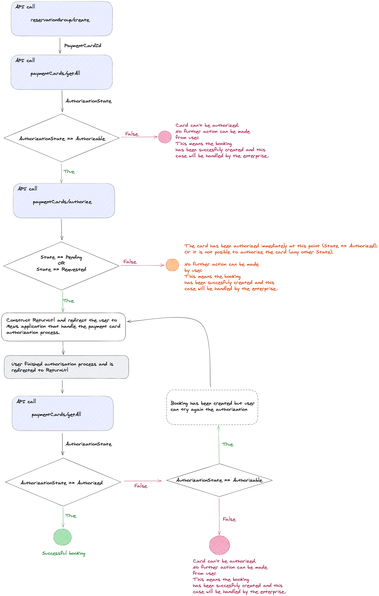

# On session payment card authorization

Whenever a user creates a reservation there is an option to let the user insert a payment card which will be stored in Mews.
You can read more about how to support payment cards in booking engine application in our [use-case](./how-to-support-payment-cards-in-booking-engine-application.md).

With PSD2 directive it might be handy for the enterprise to authorize the card for smooth payments in the future. This can minimize
the risk of a future payment being rejected.

## Creating a reservation group with verified card

First step of the entire workflow is to [create a reservation group via our API](../operations.md#create-reservation-group) with [payment card data](./how-to-support-payment-cards-in-booking-engine-application.md).
Next step is to check whether the card needs authorization via [requesting details of the card](../operations.md#get-payment-cards) and validating if the [AuthorizationState](../operations.md#authorization-state) of the card is `Authorizable`.

We can try to [authorize the card](../operations.md#authorize-payment-card) immediately. The response contains a [State](../operations.md#payment-card-authorization-state) of the authorization where no further action is needed unless the [State](../operations.md#payment-card-authorization-state) is not finite (`Pending` or `Requested`). In any other cases the card is either authorized without any
user action, or the authorization is not possible.

In case the [State](../operations.md#payment-card-authorization-state) is `Pending` or `Requested` you can redirect user to Mews application which will take care of the whole authorization process.
Simply navigate the user to url `https://[MewsApplicationsBaseUrl]/navigator/card-authorization/detail/[PaymentCardId]?returnUrl=[ReturnUrl]` which will take care of the authorization process.

A `returnUrl` query parameter is optional and will be used by the application to return the user into your booking engine after successful payment card authorization or in case the user decides to abandon the flow.
The `returnUrl` value should be a `Base64` encoded absolute url e.g. in JavaScript via `btoa` function.

After the user returns to your booking engine you can verify the card authorization state via [requesting details of the card](../operations.md#get-payment-cards) and by checking that the [AuthorizationState](../operations.md#authorization-state) of the card is `Authorized`.

## Step by step workflow
1. [Create new reservation group](../operations.md#create-reservation-group) with [CreditCardData](../operations.md#credit-card-data)
2. Get `PaymentCardId` from the response
3. Validate that the card [AuthorizationState](../operations.md#authorization-state) is `Authorizable` via [Get Payment Cards](../operations.md#get-payment-cards) endpoint. **If not the workflow ends here**.
4. Try to authorize the card via [Authorize Payment Card](../operations.md#authorize-payment-card) endpoint and check that the [State](../operations.md#payment-card-authorization-state) in the response is either `Pending` or `Requested`. **If not the workflow ends here**.
5. Create a `ReturnUrl` via encoding your url by `Base64` e.g. JavaScript example would be `btoa(urlWhereUserShouldReturn)`.
6. Redirect the user to the gateway on url `https://[MewsApplicationsBaseUrl]/navigator/card-authorization/detail/[PaymentCardId]?returnUrl=[ReturnUrl]`. You can find out the `MewsApplicationBaseUrl` in [Environments](../environments.md) section.
7. After the user returns to the `ReturnUrl` in your booking engine you can verify the state by using [Get Payment Cards](../operations.md#get-payment-cards) and verify the [AuthorizationState](../operations.md#authorization-state) is `Authorized`.

### Workflow diagram

