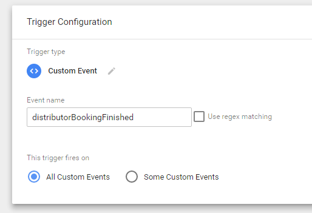
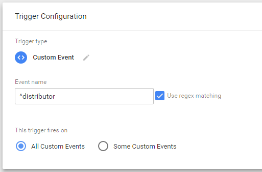
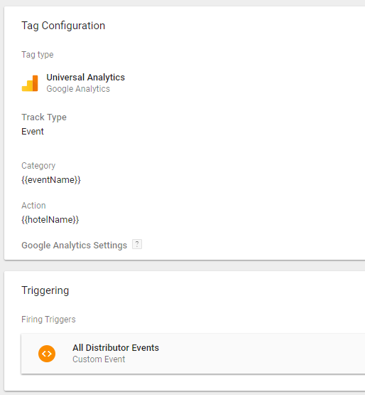
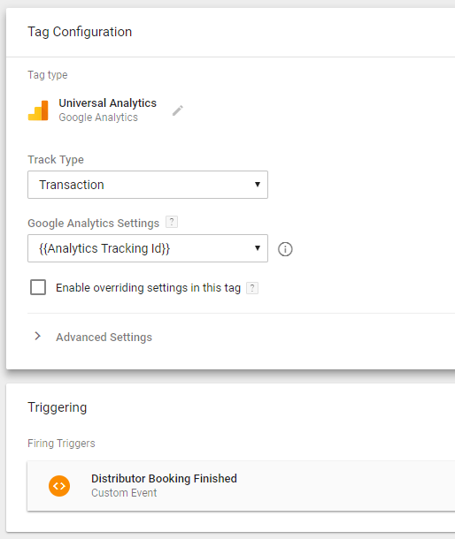
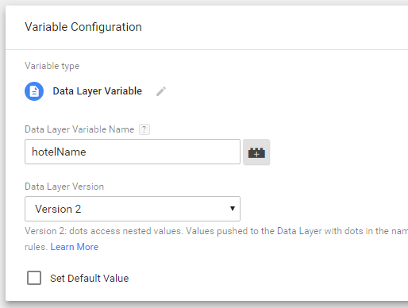

# Integrations

The main and only source of Distributor integrations with 3rd party tags and tracking services is [Google Tag Manager](https://www.google.com/analytics/tag-manager/).

## Google Tag Manager {#google-tag-manager}

This guide assumes at least basic knowledge of Google Tag Manager - how to create and publish a container, how to setup a triggers and custome events and how to connect them to a tags.

### Notice of Usage {#notice-of-usage}

**Google Tag Manager is a 3rd party service and we provide this integration as is. We export a set of supported events and their data to the container, however, we have no control over what happens with them and how they are used. Below we provide a set of basic setup examples that have been tested and verified to work with Distributor. If you need a more complex setup, it is up to you to configure and test it.**

### Enabling Google Tag Manager in Distributor {#enabling-google-tag-manager-in-distributor}

You can enable it by setting up your GTM container’s id in the Distributor's configuration in Mews Commander. The id has format`GTM-XXXXXX` and you can find it in Google Tag Manager.

**Important: It is not enough to just copy and paste the Google Tag Manager container code to a website, you have to set it up in the configuration. However, if you use the container on your website, Distributor will connect to it and will not create a new one.**

### Migrating to Google Tag Manager {#migrating-to-google-tag-manager}

In previous versions, Distributor supported direct integrations with Google Analytics and Google AdWords. These legacy integrations still remain functional for a backward compatibility, but will be removed completely in the near future. We strongly suggest you migrate them to Google Tag Manager.

**Important: If you enable Google Tag Manager in Distributor, it will take precedence over any legacy integration, and those will not be triggered. Meaning that once you enable Google Tag Manager, you will have to migrate all of your integrations to it!**

### Triggers {#triggers}

This is a basic description of how to set up a Distributor event as a Trigger. You can get full reference of all Distributor events [here](reference.md).

For an integration with Google Tag Manager, Distributor provides a set of _Custom Events \_that you can set up as_ Triggers\_. To setup a Trigger for an event, match it with its name:

If you want to track multiple events with one Trigger, you can easily use regex matching on an event name. For example`^distributor`will track every distributor event, which can be useful for setting a Trigger for Universal Analytics:

### Basic setups {#basic-setups}

#### Universal Analytics {#universal-analytics}

You can track all the events for further statistical computations about behaviour of your customers. Use the Google Universal Analytics tag with the`Event`track type. The Trigger should be a regex grouping of all the events you want to track \(to track all events, you can use`^distributor`regex as described [here](integrations.md#triggers)\).

#### Google Ecommerce {#google-ecommerce}

You can track transactions with the Google Universal Analytics tag with the`Transaction`track type on the`distributorBookingFinished`event. All the needed data for tracking is set in the Tag Manager’s _dataLayer_ and will be passed automatically.

Each reservation is send as _Product_ with quantity set to 1. Name of the reserved category is send as _Product name_, name of the hotel is send as _Product category_.

**Tracking with Mews Merchant and source attribution**

When you have Mews Merchant set up, a payment by a customer is legally required to happen on our domain. Therefore, all the transactions during a checkout are attributed to Mews domain. This is an unfortunate limitation of the checkout process that we cannot currently overcome.

### Troubleshooting {#troubleshooting}

#### There are no events or ecommerce transactions tracked after a redirect to the Mews Merchant page {#there-are-no-events-or-ecommerce-transactions-tracked-after-a-redirect-to-the-mews-merchant-page}

You have probably included the container in your website, however, you haven’t set the container id in Distributor. Meaning that after the redirect, Distributor will not know anything about your container. You should set up your GTM container’s id in the Distributor's configuration in Mews Commander.

#### I’ve set up the container correctly but there are still no events tracked {#ive-set-up-the-container-correctly-but-there-are-still-no-events-tracked}

If you have everything set up correctly and you still cannot see events tracked, please, ensure that you’re not using any ad-blocking or similar software in your browser. They tend to block not only ads, but also tracking software like Google Tag Manager. Disabling the software for testing or adding your website to the exceptions should solve the issue.

**Important:**If you are using Mews Merchant, you need to disable the software for the mews.li domain too.

#### The Tag Assistant Chrome extension shows me a warning about multiple installations, but I use only one {#the-tag-assistant-chrome-extension-shows-me-a-warning-about-multiple-installations-but-i-use-only-one}

Distributor includes our Mews Google Tag Manager container \(id`GTM-M7JV35D`\) to keep statistics in our own Google Analytics. We use that data for a global Distributor performance measuring, to have an idea about performance in hotels that don’t use Analytics and for the ability to build our own statistics on top of the Analytics API in Commander.

Having multiple installations is perfectly fine, if you keep common data layer name for all of them, which we do. Please, see the official documentation: [https://developers.google.com/tag-manager/devguide\#multiple-containers](https://developers.google.com/tag-manager/devguide#multiple-containers)

### Triggers Reference {#triggers-reference}

All events data is passed to Tag Manager through _dataLayer_. To use it in your tags, set up _Variable_ with proper name as a variable of the data layer like this:

Each event is fired with a standard set of data:

| Data Layer Variable Name | Description |
| :--- | :--- |
| eventName | Name of the event in readable form without prefix, i.e.`Step Dates`. |

If a hotel is selected, information about it is also added to the event. \(Note: The hotel is always selected in the _Singlehotel_ mode\)

| Data Layer Variable Name | Description |
| :--- | :--- |
| hotelName | name of the hotel |
| hoteId | unique identifier of the hotel |

Some events expose additional data layer variables. They are described separately for each event.

#### distributorLoaded {#distributorloaded}

The Distributor application was initialized \(triggers once per session even with a Merchant redirect\).

#### distributorConfigurationSet {#distributorconfigurationset}

Initial values were configured. When there is no custom value, it propagates the default one.

| Data Layer Variable Name | Description |
| :--- | :--- |
| startDate | Start date in ISO 8601 format YYYY-MM-DD, i.e.`2017-01-20`. |
| endDate | End date in ISO 8601 format YYYY-MM-DD, i.e.`2017-01-22`. |
| languageCode | Language code, i.e.`en-US`. |
| currencyCode | Currency code in ISO format, i.e`EUR` |
| promoCode | Value of the promo code, i.e.`promo`. |

#### distributorOpened {#distributoropened}

Distributor was opened.

#### distributorClosed {#distributorclosed}

Distributor was closed.

#### distributorStepDates {#distributorstepdates}

A Dates step was displayed.

#### distributorStepHotels {#distributorstephotels}

A Hotels step was displayed.

#### distributorStepRooms {#distributorsteprooms}

A Rooms step was displayed.

#### distributorStepRates {#distributorsteprates}

A Rates step was displayed.

#### distributorStepSummary {#distributorstepsummary}

A Summary step was displayed.

#### distributorStepCheckout {#distributorstepcheckout}

A Checkout step was displayed.

#### distributorStepConfirmation {#distributorstepconfirmation}

A confirmation page was displayed.

#### distributorLanguageCodeChanged {#distributorlanguagecodechanged}

A language code was changed.

| Data Layer Variable Name | Description |
| :--- | :--- |
| languageCode | Language code of the selected language, i.e.`en-US`. |

#### distributorCurrencyCodeChanged {#distributorstartdateselected}

A currency code was changed.

| Data Layer Variable Name | Description |
| :--- | :--- |
| currencyCode | Currency code of the selected currency, i.e.`USD`. |

#### distributorStartDateSelected {#distributorstartdateselected}

A start date of the reservation was selected.

| Data Layer Variable Name | Description |
| :--- | :--- |
| startDate | Selected start date in ISO 8601 format YYYY-MM-DD, i.e.`2017-01-20`. |

#### distributorEndDateSelected {#distributorenddateselected}

An end date of the reservation was selected.

| Data Layer Variable Name | Description |
| :--- | :--- |
| endDate | Selected end date in ISO 8601 format YYYY-MM-DD, i.e.`2017-01-22`. |

#### distributorPromoCodeSelected {#distributorpromocodeselected}

A promo code was set.

| Data Layer Variable Name | Description |
| :--- | :--- |
| promoCode | Value of the inserted promo code as a string, i.e.`promo`. It is not validated. |

#### distributorAvailabilityLoaded {#distributoravailabilityloaded}

Availability of hotel was loaded.

| Data Layer Variable Name | Description |
| :--- | :--- |
| availableRooms | Array of available rooms. |

Each item in the`availableRooms`array contains following data:

| Name | Description |
| :--- | :--- |
| roomName | Name of the room. |
| roomId | Guid of the room. |
| availableRateIds | List of available rate ids for the room |
| lowestPrice | Price of the room in hotel's default rate currency |
| price | All prices of the room in all available currencies as `(key: currency, value: price)` dictionary/object.  |

#### distributorOfferedDatesSelected {#distributoroffereddatesselected}

Alternative dates when there is no availability selected.

#### distributorRoomSelected {#distributorroomselected}

A room \(or other space type\) was selected.

| Data Layer Variable Name | Description |
| :--- | :--- |
| roomId | Guid of the selected room. |
| roomName | Name of the selected room in the hotel’s default language. |
| spaceType | Name of the selected room’s space type, one of`Room`,`Bed`or`Dorm`. |

#### distributorSpaceTypeCountChanged {#distributorspacetypecountchanged}

A number of the selected “rooms” in the order was changed.

| Data Layer Variable Name | Description |
| :--- | :--- |
| count | Number of the selected space types. |

#### distributorRoomOccupancyChanged {#distributorroomoccupancychanged}

An occupation \(adults and children counts\) was changed for the one room \(or similar\) space type.

| Data Layer Variable Name | Description |
| :--- | :--- |
| roomIndex | Index of the changed room. |
| adultCount | Number of the selected adults. |
| childCount | Number of the selected children. |

#### distributorBedOccupancyChanged {#distributorbedoccupancychanged}

An occupation \(adults and children counts\) was changed for the bed space type.

| Data Layer Variable Name | Description |
| :--- | :--- |
| adultCount | Number of the selected adults. |
| childCount | Number of the selected children. |

#### distributorProductAdded {#distributorproductadded}

A product was added to the order.

| Data Layer Variable Name | Description |
| :--- | :--- |
| productId | Guid of the added product. |
| productName | Name of the product in the hotel’s default language. |

#### distributorProductRemoved {#distributorproductremoved}

A product was removed from the order.

| Data Layer Variable Name | Description |
| :--- | :--- |
| productId | Guid of the removed product. |
| productName | Name of product in the hotel’s default language. |

#### distributorBookingPrepared {#distributorbookingprepared}

A booking is prepared and user needs to enter their details. This event triggers when user reaches Checkout step.

| Data Layer Variable Name | Description |
| :--- | :--- |
| totalCost | current total cost of the reservation group, in the hotel’s default currency |

#### distributorBookingFinished {#distributorbookingfinished}

A booking was made. This event triggers once every reservation group is made.

| Data Layer Variable Name | Description |
| :--- | :--- |
| reservationGroupId | id of the reservation group |
| totalCost | total cost of the reservation group, in the hotel’s default currency |
| currencyCode | hotel’s default currency code in ISO format |

#### distributorReservationCreated {#distributorreservationcreated}

A reservation was created. This event triggers when each reservation is made in the reservation group.

| Data Layer Variable Name | Description |
| :--- | :--- |
| customerEmail | the customer’s email |
| customerName | the customer’s name |
| currencyCode | hotel’s default currency code in ISO format |
| reservationGroupId | id of the reservation group |
| reservation.id | id of the reservation |
| reservation.roomId | id of the room category |
| reservation.rateId | id of the rate of the reservation |
| reservation.number | confirmation number of the reservation |
| reservation.roomName | name of the room |
| reservation.startDate | start date of the reservation |
| reservation.endDate | end date of the reservation |
| reservation.nights | total nights spent |
| reservation.cost | cost of the reservation in the hotel’s default currency |

