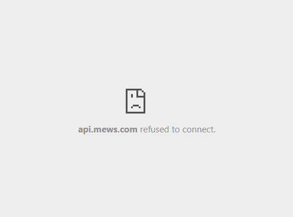
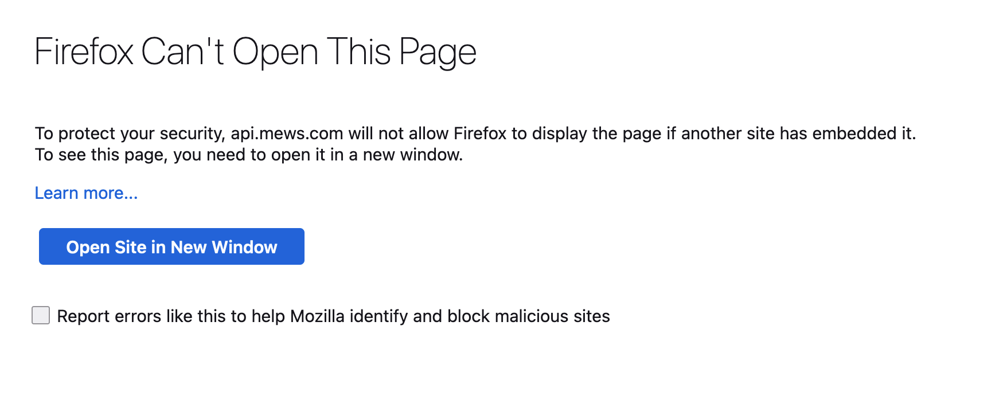

# Troubleshooting - Distributor Widget

## Distributor shows an error "api.mews.com refused to connect"

Browser says it can't open the page because of security or there's a console error mentioning api.mews.com and X-Frame-Options.

- `[Error] Refused to display 'https://api.mews.com/distributor' in a frame because it set 'X-Frame-Options' to 'sameorigin'.`
- `The loading of "https://api.mews.com/distributor" in a frame is denied by "X-Frame-Options" directive set to "sameorigin".`

Distributor is not working because Distributor is not installed correctly on your page. Installing Distributor in any other way than as guides describe is not supported and can cause errors such as "api.mews.com refused to connect".

You can try to confirm Distributor is not installed correctly by inspecting the DOM of the page:
- Open the page with Distributor and make it show the error.
- Open your browser developer tools with DOM/elements inspector.
- In the inspector look for any tags like `<iframe src="https://api.mews.com/distributor/aaaaaaaa-bbbb-cccc-dddd-eeeeeeeeeeee">`.

There shouldn't be any iframe tag with a `src` attribute pointing to `api.mews.com` domain.

If you find something like that, the problem could be in the way the Distributor is installed. And even if you didn't find anything like that, it's better to check if Distributor is installed correctly.

### How to fix it

[Decide if you want to use/are using Distributor Standalone or Distributor Widget](../README.md).

Go through relevant installation guide and make sure your page and code is doing everything correctly:
- [Distributor Standalone Getting started guide](../distributor-standalone/getting-started.md)
- [Distributor Widget Getting started guide](./getting-started.md)

If you are using [Distributor Widget](./README.md), pay special attention to [the requirements section of the Distributor Widget Getting started guide](./getting-started.md#requirements). It has a list of things to do and common mistakes in don't sections during the installation of Distributor.
