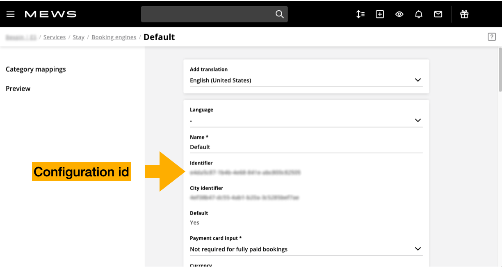
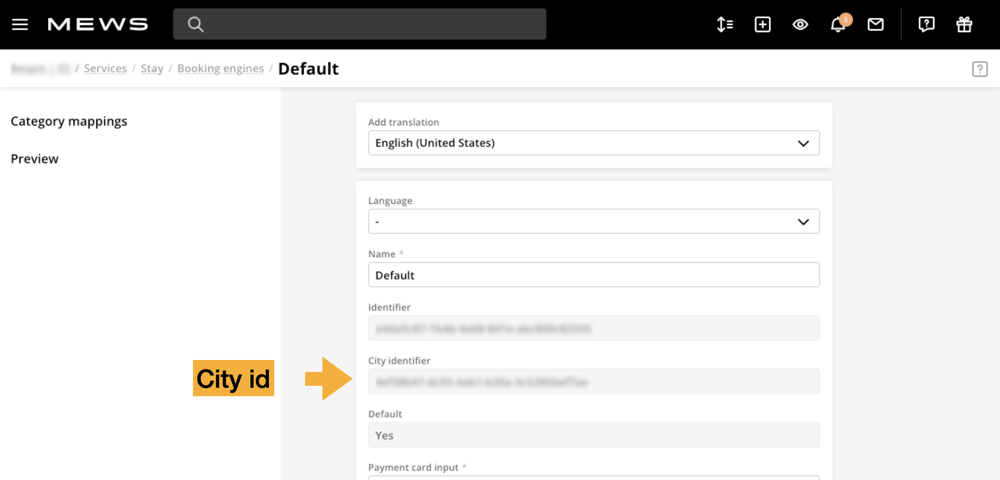

# FAQ

## Where to get configuration id?

You can find it in Commander PMS.

* Start on **Dashboard** (main) screen.
* In the left menu select **Settings** -> **Services**.
* In a section **Bookable services** select service which has the Distributor configuration. If there's just one, try that one.
* On the left select **Booking engines**.
* Select configuration you want to use.
* At the upper section you have field **Identifier**. This is your configuration id. It has a format `aaaaaaaa-bbbb-cccc-dddd-eeeeeeeeeeee`.

## Why Distributor doesn't use the configuration ids I've provided?

It could be that some of those ids are not valid configuration ids.

Please check that:
* All used configuration ids are really configuration ids, not chain, enterprise or other ids.
* All used configuration ids are defined in Commander PMS from the same [environment](./distributor-api-v1/environments.md) as the Distributor you are using.
* You are using only one configuration id per enterprise.

## Where to get city id?

You can find it in Commander PMS.

* Start on **Dashboard** (main) screen.
* In the left menu select **Settings** -> **Services**.
* In a section **Bookable services** select service which has the Distributor configuration which you use. If there's just one, try that one.
* On the left select **Booking engines**.
* Select configuration which you use.
* At the upper section you have field **City Identifier**. This is your city id. It has a format `aaaaaaaa-bbbb-cccc-dddd-eeeeeeeeeeee`.

